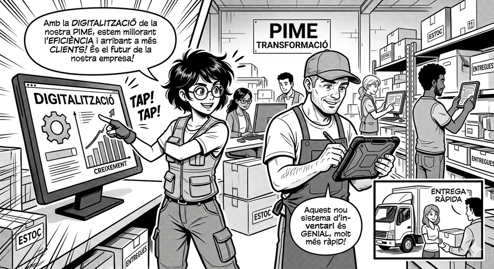

<p align="center">
  
<h1 align="center">Proyecto 8 - Connecta.t_al_Futur</h1>


## Conéctate al futuro: el reto de la digitalización real  

</p>

<p align="center">
  
</p>

<p align="center">
  
  
  
  
  
</p>

---

## 1. Introducción

Este proyecto representa la fase final del ciclo formativo y simula un entorno profesional donde se requiere aplicar conocimientos técnicos en un contexto real.

El alumno asume el rol de **consultor tecnológico**, trabajando con pequeñas y medianas empresas (PYMES) que necesitan avanzar en su proceso de digitalización.

---

## 2. Contexto del proyecto

Actualmente, muchas PYMES presentan una situación común:

- Conocen su producto o servicio
- Tienen experiencia en su sector
- Carecen de adaptación tecnológica

Este proyecto aborda la necesidad de:

- Modernizar estructuras empresariales
- Implementar soluciones digitales reales
- Mejorar la competitividad del negocio

---

## 3. Objetivo

Diseñar una solución tecnológica completa basada en:

- Análisis de necesidades reales  
- Propuesta técnica adaptada  
- Optimización de procesos  
- Mejora de seguridad  
- Transformación digital  

El objetivo no es únicamente implementar tecnología, sino aportar valor real al cliente.

---

## 4. Enfoque profesional

El proyecto se orienta a un escenario de consultoría IT donde se debe:

- Analizar la situación actual del cliente  
- Detectar problemas e ineficiencias  
- Proponer soluciones viables  
- Justificar decisiones técnicas  

Se trabaja con un enfoque práctico que simula situaciones reales del mercado laboral.

---

## 5. Sostenibilidad y tecnología

Uno de los ejes clave del proyecto es la integración de criterios de sostenibilidad.

Se aplican los **Objetivos de Desarrollo Sostenible (ODS)** en la propuesta tecnológica:

- Uso eficiente de recursos  
- Reducción del consumo energético  
- Optimización de infraestructuras  
- Uso responsable de la tecnología  

La solución debe ser:

- técnica  
- eficiente  
- sostenible  

---

## 6. Áreas de trabajo

| Área | Descripción |
|------|-----------|
| Análisis | Estudio de necesidades del cliente |
| Infraestructura | Soluciones tecnológicas propuestas |
| Seguridad | Protección de datos y sistemas |
| Digitalización | Transformación de procesos |
| Sostenibilidad | Aplicación de criterios ODS |

---

## 7. Tareas del proyecto

- **T01** Análisis de necesidades del cliente  
- **T02** Diseño de plan de sostenibilidad  

---

## 8. Metodología

El desarrollo del proyecto sigue una estructura basada en:

- Análisis → comprensión del problema  
- Diseño → propuesta de solución  
- Implementación → adaptación técnica  
- Documentación → justificación profesional  

Se recomienda el uso de:

- Markdown para documentación  
- Diagramas (Mermaid u otros)  
- Estructuración clara del repositorio  

---

## 9. Entrega del proyecto

El proyecto se gestiona a través de GitHub Classroom:

- SMX 2n A: https://classroom.github.com/a/kK1qCM2A  
- SMX 2n B: https://classroom.github.com/a/f1QazMyI  

---

## 10. Estructura del repositorio

```text
proyecto8/
├── README.md
├── tasques/
│   ├── tasca01.md
│   ├── tasca02.md
├── docs/
│   ├── Comp.md
│   ├── RAs.md
│   ├── CPS.md
│   ├── Grupos.md
├── img/
│   └── pic1.png
