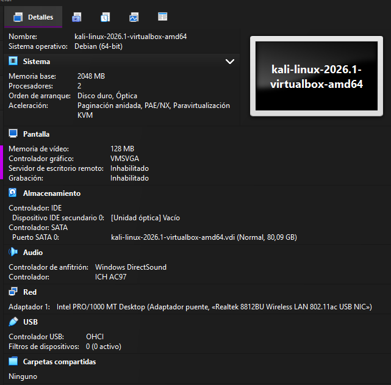
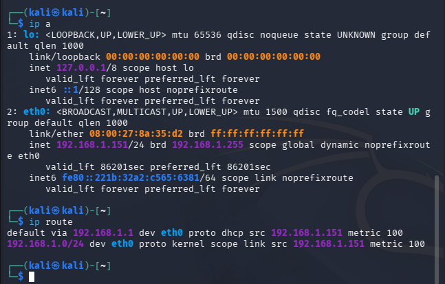
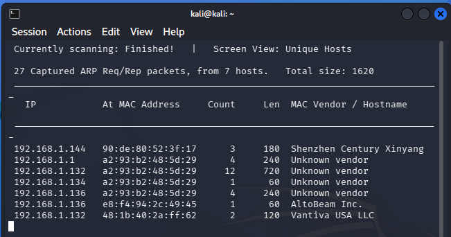
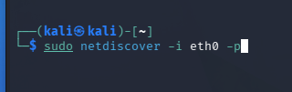
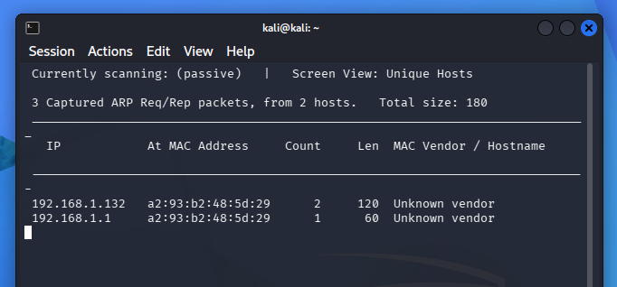
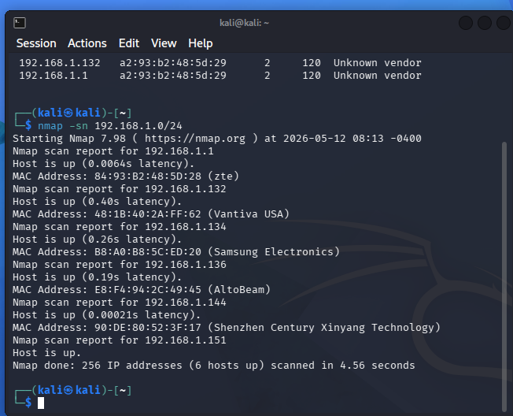
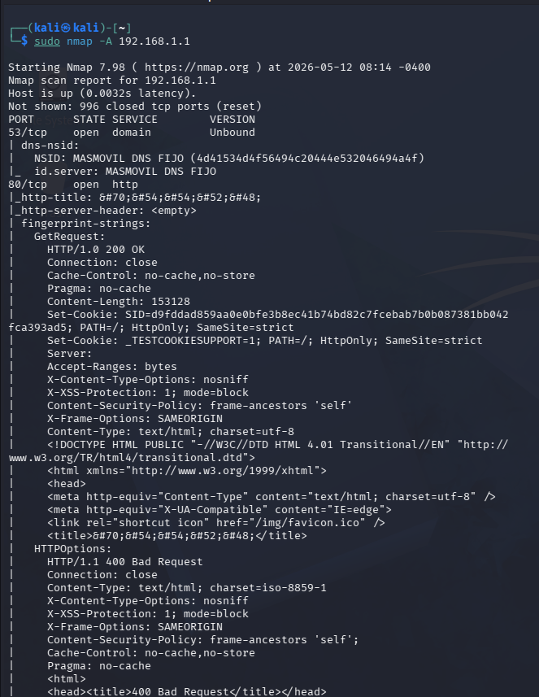
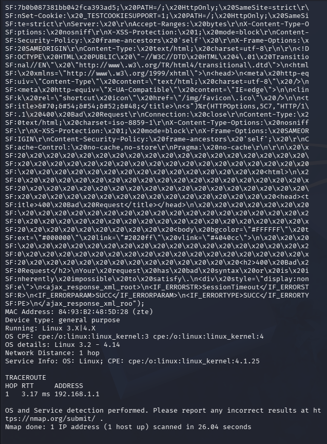

# **GUÍA PRÁCTICA: EXPLORACIÓN DE RED CON KALI LINUX (ENTORNO DOMÉSTICO)**

En casa
Santiago Hernandez

***

## **1. Introducción**

En esta práctica se ha realizado una exploración de la red local desde un entorno doméstico utilizando Kali Linux. Se han empleado herramientas de análisis como **Netdiscover** y **Nmap** con el objetivo de identificar dispositivos conectados, analizar servicios y comprender el comportamiento real de una red.

Esta actividad permite aplicar conceptos de ciberseguridad y administración de redes en un entorno práctico y realista.

***

## **2. Configuración inicial**

Para poder realizar correctamente la exploración, la máquina virtual Kali Linux se ha configurado con los siguientes parámetros:

*   Adaptador de red en **modo puente (Bridge)**
*   Configuración automática mediante **DHCP**

Esto permite que la máquina virtual forme parte de la misma red que el resto de dispositivos.

 

***

### **Comprobación de la IP**

Se ha utilizado el siguiente comando:

```
ip a
```

**Resultado:**

*   Dirección IP: **192.168.1.151**
*   Interfaz activa: **eth0**


***

### **Identificación de la red**

```
ip route
```

**Resultado:**

*   Red: **192.168.1.0/24**
*   Puerta de enlace (router): **192.168.1.1**

 

***

## **3. Exploración con Netdiscover**

***

### **3.1 Modo activo**

```
sudo netdiscover -r 192.168.1.0/24
```

 

**Resultados obtenidos:**

*   Se han detectado aproximadamente **7 dispositivos activos**
*   Se han identificado direcciones IP y direcciones MAC
*   Se han reconocido fabricantes como:
    *   ZTE (router)
    *   Shenzhen Century
    *   AltoBeam
    *   Vantiva


 

**Conclusión:**

El modo activo envía peticiones ARP a toda la red, lo que permite detectar dispositivos incluso si no están generando tráfico en ese momento. Este método es especialmente eficaz en redes locales, ya que ARP no suele ser bloqueado.

***

### **3.2 Modo pasivo**

```
sudo netdiscover -i eth0 -p
```

 

**Resultados obtenidos:**

*   Se han detectado únicamente **2 dispositivos**
*   Se ha capturado una cantidad muy reducida de tráfico

 

**Conclusión:**

El modo pasivo no envía paquetes, sino que se limita a escuchar el tráfico existente en la red. Por este motivo, únicamente detecta dispositivos que están generando actividad en ese momento.

***

### **3.3 Comparativa entre modo activo y pasivo**

| Característica | Modo activo | Modo pasivo |
| -------------- | ----------- | ----------- |
| Detección      | Alta        | Baja        |
| Método         | ARP         | Escucha     |
| Tráfico        | Genera      | No genera   |
| Precisión      | Elevada     | Dependiente |

**Conclusión general:**

El modo activo proporciona una visión más completa de la red, mientras que el modo pasivo es más discreto pero depende del tráfico existente, lo que reduce la cantidad de dispositivos detectados.

***

## **4. Exploración con Nmap**

***

### **4.1 Descubrimiento de hosts**

```
nmap -sn 192.168.1.0/24
```

 

**Resultados:**

*   Se detectan menos dispositivos que con Netdiscover
*   Algunos dispositivos no responden

**Conclusión:**

Nmap utiliza ICMP y otros métodos de detección, por lo que algunos equipos no responden debido a configuraciones de seguridad o firewalls.

***

### **4.2 Análisis detallado del router**

```
sudo nmap -A 192.168.1.1
```

 

 

***

### **Resultados obtenidos**

**Puertos abiertos:**

*   53/tcp → DNS
*   80/tcp → HTTP
*   443/tcp → HTTPS
*   52869/tcp → UPnP

**Servicios identificados:**

*   Servicio DNS para resolución de nombres
*   Panel web de administración del router (HTTP/HTTPS)
*   Servicio UPnP para gestión automática de dispositivos

**Sistema operativo:**

*   Linux (kernel entre versiones 3.x y 4.x)
*   Sistema embebido típico de routers

**Fabricante:**

*   ZTE

**Análisis adicional:**

El router implementa medidas de seguridad como cabeceras HTTP de protección (XSS, Content Security Policy), lo que indica un cierto nivel de protección en el dispositivo.

***

### **4.3 Escaneo completo de puertos**

```
sudo nmap -p- 192.168.1.1
```

 

**Conclusión:**

El router presenta un número reducido de puertos abiertos, lo que indica una superficie de ataque limitada y una configuración relativamente segura.

***

## **5. Consideraciones del entorno doméstico**

A diferencia del entorno de aula, en este entorno doméstico no se dispone de un servidor Ubuntu adicional. Por este motivo, el análisis detallado se ha centrado en el router como dispositivo principal de la red.

***

## **6. Conclusiones finales**

La exploración de red realizada demuestra que el análisis de redes locales requiere el uso combinado de diferentes herramientas, ya que cada una presenta ventajas y limitaciones.

Por un lado, Netdiscover permite una detección más efectiva de dispositivos en redes locales mediante ARP, mientras que Nmap proporciona un análisis más profundo de servicios, puertos y sistema operativo.

Además, se observa que los dispositivos de red domésticos aplican medidas de seguridad que limitan la información accesible, reflejando situaciones reales en entornos profesionales.

En conjunto, esta práctica permite desarrollar una visión práctica de la enumeración de redes y la importancia de interpretar correctamente los resultados obtenidos.
